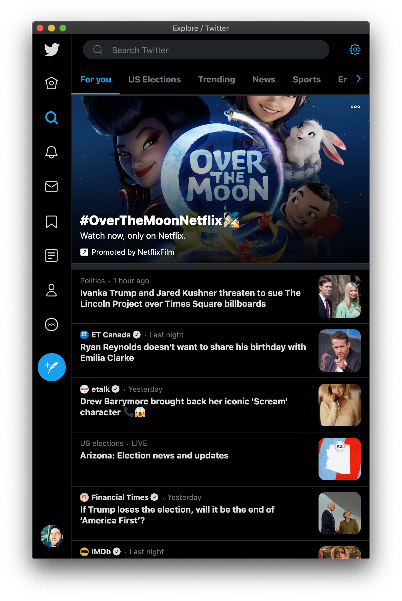

# Twitter.com for Mac



An (unofficial) native MacOS App for Twitter.com.

# Install

## Homebrew Cask

### Install

```bash
brew tap aubreypwd/homebrew-cask
brew update
brew cask install twitter
```

### Upgrade

```
brew update
brew upgrade twitter
```

## Download

Or download the `.dmg` in [releases](https://github.com/aubreypwd/twitter-mac/releases/latest) and install per usual.

---

# Development

1. Clone repo
2. `npm install`
3. `npm run build`

`npm run build` will built the application to `build/` and  `npm run dist` to generate a `.dmg` in `dist/` for distribution and installation.
